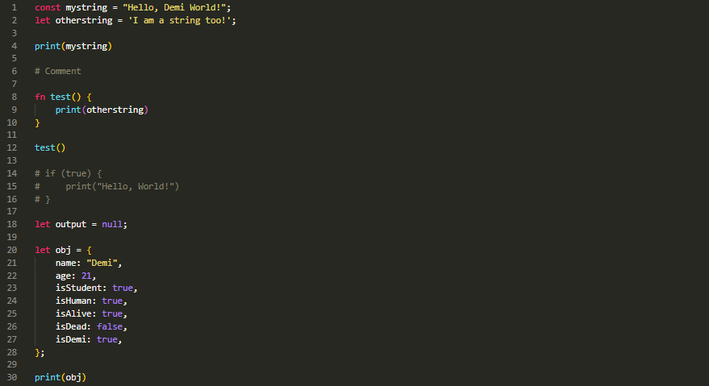

# demi-syntax README

Syntax Highlighting support for the Demi programming language developed by Bobrossrtx.

## Features

> Note: This extension doesn't come with auto-completion, but it is planned for the future

<!-- ## Known Issues

Calling out known issues can help limit users opening duplicate issues against your extension. -->

## Release Notes

### 0.0.1
Initial release of Demi Syntax highlighting

- Added support for comments
- Added support for keywords
- Added support for strings
- Added support for numbers
- Added support for functions
- Added support for variables

## For more information

> COMING SOON
